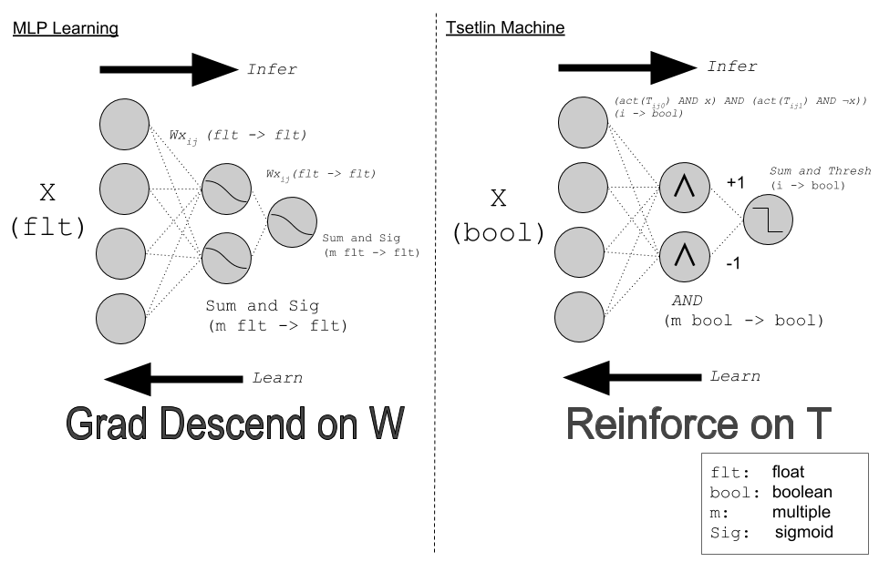

# Microtsetlin

A minimal implementation of [tsetlin machines](https://arxiv.org/abs/1804.01508) in python (>3).
Not strictly a library yet, see `train()` for training algorithm.
The jupyter notebook contains a WIP visualisation of the tsetlin state.

Versions
- NNP - no numpy - straight python arrays with some of the randomness removed.
- NR - no randomness - removes all the random calls and replaces with a uniform calls.
- MADD - integrating the MADD array for fast thresholding


# Tstelin Machines: A Newcastle Perspective

## Introduction

Tsetlin Machines belong to a new class of machine learning architectures
based on a trained ensemble of propositional clauses, which each
independently vote, via a threshold operation, for a binary outcome.
The training is  performed using a game theoretic update method 
which decouples overall decision from individual clause output.
There are several key benefits to this
approach which make it suitable for low level hardware implementation, these are:

1. Lack of complex arithmetic operations in inference
2. Lack of differential flow to enact training during the learning phase 

Below, we describe the key architectural pieces which form a Tsetlin Machine, the general flow
of this discussion being :

1. What is a learning automata in this implementation?
2. What propositional clauses structure is used?
3. How to implement inference.
4. How to implement learning.

At a later date this discussion will be extended to include:

1. Methods of removing randomness for a simpler hardware design.
2. Multiplexed unary for simplified thresholding.

The image below details an early effort at comparing the architecure with Neural Network:



## What is a learning automata in this implementation?

**A Counter**. 

In this implementation a learning automata is a simple `int` counter, whose use is governed
by an ``action`` function, which simply binarises on a mid level threshold. In python this is:

```python
action = lambda state: NO_ACT if state <= MIDSTATE else ACT #note: MIDSTATE = INACTION 
```
The automata are the memory of this system and can take _state_ usual between 0 and 100.

Two key points here:
1. The threshold is the key method of turning the int counter into a binary action, which includes or excludes
a feature.  
2. This is what's updated in the learning phase.
3. There are TWO automata for each input variable - one to include the literal and one to include 
NOT the literal. The general data structure is then:

```python
tsetlin[clauses][features][literals]
```

## What propositional clauses structure is used?

` NOT(X1) AND X1 AND NOT(X2) AND X2 ... NOT(Xn) AND Xn` where `Xn` is a feature (input variable)  

This is implemented as the following:

```python
def calc_clause_output(c):
        """output is a tuple (x,bool), where bool is whether the clause has used literals"""
        used = 0  
        for f in range(num_f):
            used += action(tsetlin[c,f,LIT]) + action(tsetlin[c,f,NOT_LIT])
            if (action(tsetlin[c,f,LIT]) == ACT and x_hat[f] == 0) or (action(tsetlin[c,f,NOT_LIT]) == ACT and x_hat[f] == 1):
                return (0,True)
        live = True if not prune else (used != 0)
        return (1, live) 
```
Due to the nature of `AND` clauses can end early.

## How to implement inference

Inference is implemented via the threshold of a weighted sum of a collection of clauses. In python this looks like
this:

```python
clause_output = calc_all_clause_outputs(x_hat, tsetlin)
tot_c_outputs = np.sum([c_out*sign if live else 0 for (c_out,live),sign in zip(clause_output,clause_sign)])
y_est = 1 if tot_c_outputs >= 0 else 0 #nte: total 0 = output 1
```

The weights are designed to produce clauses to inhibit or excite the output, in the original paper this is performed
using the clause_sign series $[1,-1,1, ... ]$ in my code it is `[1,1,1,...,-1,-1,-1,...]`

```python
clause_sign   = np.array(num_c2*[1] + num_c2*[-1]) 
polarity      = np.array(num_c2*[1] + num_c2*[0] ) 
```
The output is binary.

## How to implement learning

Learning is implemented via a table lookup which finds an action from a tuple `(y,p,c,x,action(tsetlin[c,f,s)` via a bit shifted
operation.

The action can be a reward or inaction or a penalty or inaction, which again is the tuple `(reward,inaction,penalty)`. The data structure which governs this is the `u` matrix, which is referenced using as single index of bit-shifted references: 

```python
update_tuple = u[y_sft|p_sft|c_sft|x_sft|action(tsetlin[c,f,s])]
```
here:
- y_sft - `desired output` shifted
- p_sft - `polarity` shifted 
- c_sft - `clause` output shifted 
- x_sft - `actual input` shifted

There is some randomness to _when_ this is done and whether there is `inaction`. 
The _when_ is governed by the function:

```python
t_d = max(-T, min(T,t_in))
p_update = 1.0*(T - t_d)/(2*T) if y_hat == 1  else 1.0*(T + t_d)/(2*T)
```

and the choice of `reward`/`penalty` or `inaction` is perform using a choice function:

```python            
update_action = np.random.choice([REWARD,INACTION,PENALTY],p=update_tuple)
```
I'm not sure this is needed but it's in the original paper.
The clever piece of this work is the choice of learning updates, this document will not explain this in detail, but refer you
to the section on nash equilibriums in the original paper.


